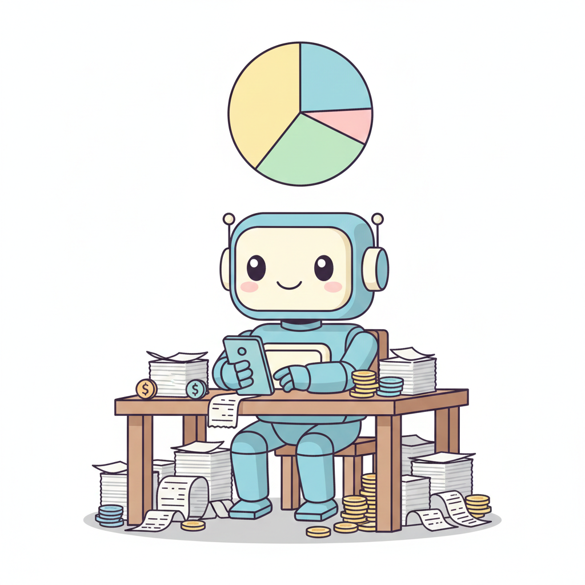
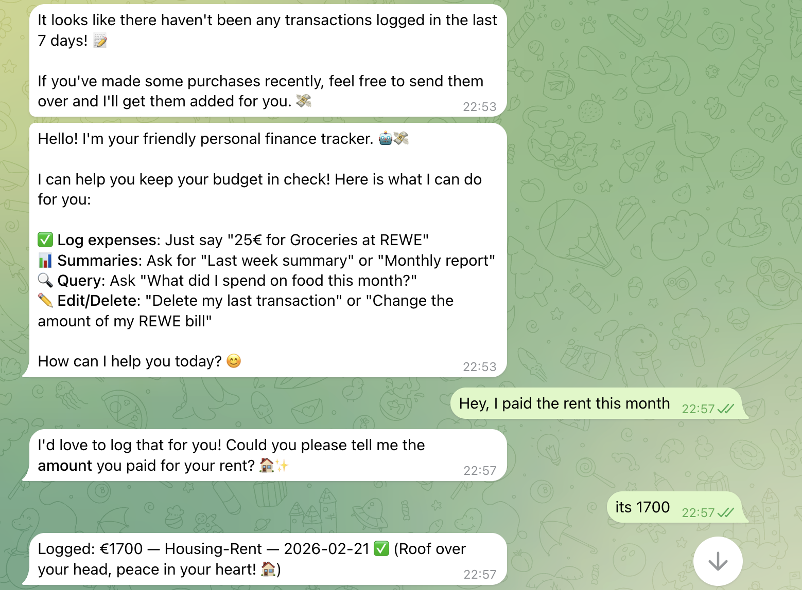
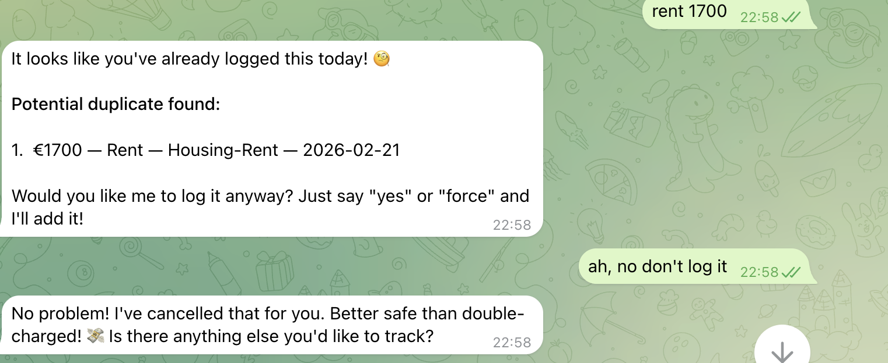
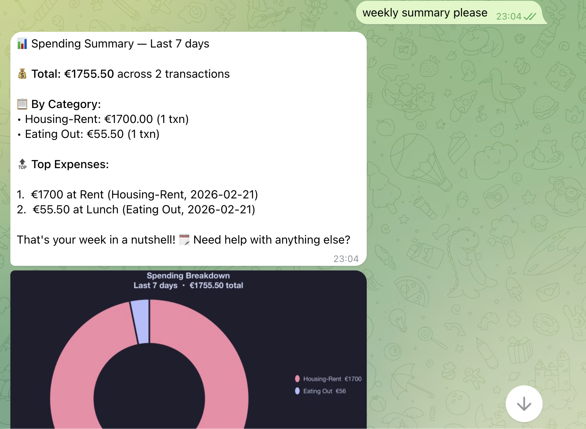

# Personal Finance AI Agent

<p align="center">
  
</p>

A Telegram bot powered by [Mastra](https://mastra.ai) that tracks personal finances using AI. Send expenses as text, photos, voice messages, or documents — the bot extracts, categorizes, and stores transactions automatically. Built-in duplicate detection prevents double entries. Get spending summaries with pie/bar chart visualizations.

---

## Quick Start

### Prerequisites

- Node.js 20+
- MongoDB (local or Atlas)
- Telegram Bot Token (from @BotFather)
- Google Gemini API Key (from [Google AI Studio](https://aistudio.google.com/app/apikey))

### Setup

```bash
npm install

cp .env.example .env.development
# Edit .env.development with your credentials:
#   TELEGRAM_BOT_TOKEN=...
#   GOOGLE_GENERATIVE_AI_API_KEY=...
#   MONGODB_URI=...

npm run dev
```

### Test It

1. Open Telegram, find your bot
2. Send: `Rent 1250€ paid`
3. Bot replies: `Logged: €1250 — Housing-Rent — 2026-02-21 ✅`

---

## Tech Stack

| Component | Technology |
|-----------|-----------|
| Agent Framework | [Mastra](https://mastra.ai) (@mastra/core) |
| LLM | Google Gemini Flash via @ai-sdk/google |
| Telegram Bot | grammY |
| Database | MongoDB + GridFS |
| Schema Validation | Zod |
| Charts | chartjs-node-canvas |
| Language | TypeScript (strict mode) |

---

## Screenshots

<table>
  <tr>
    <td align="center" width="33%">
      <br />
      <b>Conversational Logging</b><br />
      <sub>Natural language expense tracking with auto-categorization</sub>
    </td>
    <td align="center" width="33%">
      <br />
      <b>Duplicate Detection</b><br />
      <sub>Catches potential duplicates before saving</sub>
    </td>
    <td align="center" width="33%">
      <br />
      <b>Spending Summary</b><br />
      <sub>Category breakdown with pie chart visualization</sub>
    </td>
  </tr>
</table>

---

## What It Does

- **Log expenses** — send text, photos, voice, or documents. The agent extracts amount, vendor, category, and date
- **Query transactions** — "Show me last 5 transactions", "What did I spend yesterday?"
- **Edit & delete** — "Change the REWE amount to 40€", "Delete the last transaction"
- **Spending summaries** — natural language or `/summary` command with pie/bar charts
- **Media processing** — receipt photos, voice messages, PDF invoices

---

## Commands

| Command | Action |
|---------|--------|
| `/summary` | Current month summary + pie chart |
| `/summary week` | Last 7 days summary |
| `/summary bar` | Summary with bar chart |

---

## Categories (v1)

**Structural**: Housing-Rent, Utilities-Electricity, Utilities-Internet, Childcare-Kita, Transport, Investments-Scalable Capital

**Daily**: Groceries, Eating Out, Subscriptions, Health, Shopping, Travel, Misc

---

## Architecture

```
User (Telegram) → grammY Bot → Mastra Agent (1 LLM call) → Tools (DB only) → MongoDB
                                      ↕
                                Memory (MongoDB)
```

- **Agent does ALL reasoning** — parse, categorize, decide — in a single LLM call
- **Tools are simple** — DB operations only, no LLM calls, <50 lines each
- **5 tools**: store (with built-in duplicate check), query, update, delete, spending-summary
- **1 workflow**: spending summary (fetch data → agent generates report → chart)

See [CONTEXT.md](CONTEXT.md) for detailed architecture docs.

---

## Project Structure

```
src/
├── bot/              # Telegram bot
│   ├── handlers/     # message, media, summary handlers
│   └── middleware/    # auth, media processing
├── mastra/           # AI agent layer
│   ├── agents/       # Finance agent (instructions + model)
│   ├── tools/        # 5 tools (DB operations only)
│   └── workflows/    # Spending summary workflow
├── database/         # MongoDB client, repositories, schemas
├── config/           # Environment, categories, constants
└── utils/            # Chart generation
```

---

## Development

```bash
npm run dev          # Start with hot reload (tsx)
npm run build        # Build for production
npm run lint         # Check code style
```

---

## Documentation

| File | Purpose |
|------|---------|
| [CLAUDE.md](claude.md) | Project rules for Claude Code |
| [CONTEXT.md](CONTEXT.md) | Architecture, patterns, guidelines |
| [spec.md](spec.md) | Product specification |

---

## License

MIT
